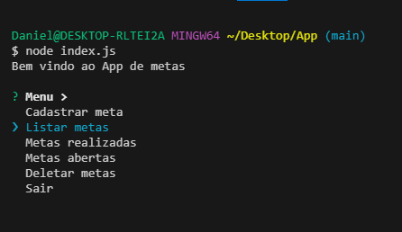

# Projeto de gerenciamento de metas 🚀

> Aplicativo de metas feito para gerenciar e controlar as metas diárias.

## 📝 Descrição

Aplicativo de gerenciamento de metas diárias, criado para ter controle das suas metas, além da possibilidade de manipular dados. O projeto tem como funcionalidade, auxiliar na gerência de suas metas e objetivos. 

## ⚙️ Funcionalidades

- ✅ _Cadastrar metas_ 
- ✅ _Listar as metas cadastradas_
- ✅ _Marcar as metas feitas_
- ✅ _Listar as metas já realizadas_
- ✅ _Listar as metas a serem feitas_
- ✅ _Deletar metas_

## 🖥️ Demonstração

## Linguagens utilizadas

 
 
 
 

 ## Editor usado para codar
 

          

